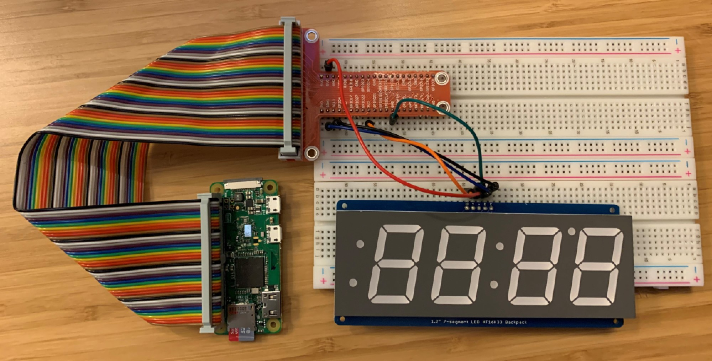
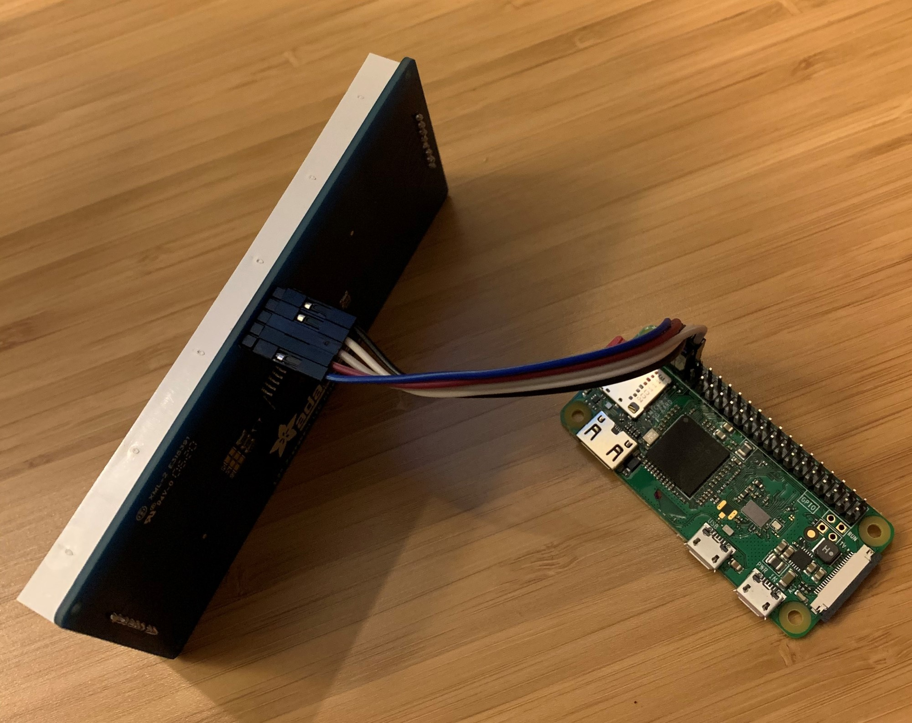

# echopitimer
Raspberry Pi Timer for Echo implementation for 7-segment display

# Motivation
While I enjoy the simplicity of spoken word commands available on Alexa, I find myself annoyed when having to consistently asking for status updates.

This is the most prevalent when using timers in the kitchen, which our family uses multiple times daily.  While getting status updates via voice, I often had to repeat what I was saying or wait for a quiet moment in the house to get my command in.  I wanted a way to use the Echo to set a timer easily without having to stop what I'm cooking, but craved an easy to read display to show these timers.

While I know that there are Echo devices with screens, I didn't need any of the other functionality, and thought it a good opportunity to tinker with hardware to come up with a custom solution.

# Architecture

This project uses Home Assistant with the Alexa Media Player integration to detect timer events from your Echo devices, then forwards them via MQTT to a Raspberry Pi Zero W that displays the countdown on a 7-segment display:

```
"Alexa, set a 10 minute timer"
        │
        ▼
   Echo Device
        │
        ▼ (detected via Alexa Media Player integration)
Home Assistant
        │
        ▼ (MQTT publish)
   Raspberry Pi Zero W
        │
        ▼
  7-Segment Display
```

**Important:** You'll need a separate device to run Home Assistant (Raspberry Pi 3/4, old laptop, NAS, etc.) as the Pi Zero W is too underpowered. The Alexa Media Player integration is a community-maintained project and is not officially supported by Amazon.

# Hardware used
1. [Raspberry Pi Zero W with installed headers](https://www.raspberrypi.org/pi-zero-w/)
1. MicroSD card with USB Reader
1. [Adafruit 1.2" 4-Digit 7-Segment Display w/I2C Backpack](https://www.adafruit.com/product/1270)
1. Options for connection from Raspberry Pi to 7-segment display
    * *(optional, for prototyping)* [T expansion board with 40-pin ribbon cable](https://www.adafruit.com/product/2028) and [breadboard](https://www.adafruit.com/product/239)
    * [Jumper cables](https://www.adafruit.com/product/794)
1. [Echo dot or whatever flavor](https://www.amazon.com/echo)
1. A separate device to run Home Assistant (Raspberry Pi 3/4, old laptop, NAS, etc.)

# Installation/configuration
These guides below have all of the information that you need to assemble this project; I will inject a bit of color commentary of my experience and some pictures.

## Raspberry Pi setup

### 1. OS install
I used the [Raspberry Pi imager](https://www.raspberrypi.org/downloads/) with the *Raspberry Pi OS (32-bit) Lite* image, since desktop software is not needed here.  This image comes in at a scant ~500MB, allowing you to use as small as a 1GB SD card for this build to keep costs down.  

#### Steps
1. Insert the unformatted SD card into the USB reader
1. Plug the reader into your computer of choice
1. Fire up the Raspberry Pi imager application and choose the List image
1. Choose your SD card as destination

*Walkthru: https://learn.adafruit.com/raspberry-pi-zero-creation/install-os-on-to-sd-card*

### 2. enable ssh and wifi in OS

I didn't bother buying a micro-HDMI connector for this, since all I needed was shell access and am not runnind a desktop environment.  As the Zero W comes with WIFI built in, it is simple enough to enable this and have it connect to a WIFI network on boot.  To enable wifi on boot, you will have to open up the newly formatted SD card and create a file on the root of the drive.

#### Steps
1. Open SD card file system in explorer app of your choice
1. Copy [*wpa_supplicant.conf*](https://learn.adafruit.com/pages/9244/elements/2827363/download) to the root folder of the SD card
1. Modify the file with your SSID and WIFI Password

*Walkthru: https://learn.adafruit.com/raspberry-pi-zero-creation/text-file-editing#configure-wifi-2827362-3*

### 3. Enable SSH

Now that the .conf file exists to enable and connect to WIFI on boot, SSH must be enabled.  Use the terminal program of your choice to connect.

#### Steps
1. Open SD card file system in explorer app of your choice
1. Create a file called *ssh* in the root folder of the SD card 

### 4. Power up device

Plug in a micro-sd power connection to turn the Pi on.  I've read that powering a Pi directly from a USB port on a PC/laptop isn't a good idea because of voltage fluxuations. 

### 5. Connect to Pi via SSH

Once the Pi has been given 30 seconds or so to boot up, connect to it using SSH.  There are lots of options for SSH clients, the most popular likley being [PuTTY](https://www.chiark.greenend.org.uk/~sgtatham/putty/latest.html).

#### Steps
1. Determine IP address given to your Pi on your wireless network.  Read the wireless router documentation to find out where this is located.  Here is the listing on a ASUS router:


1. Connect to pi@PI-IP-ADDRESS (e.g. pi<span>@</spaN>192.168.1.75)
1. The default password upon the first boot is `raspberry`

### 6. Update OS and enable I2C

Now the OS needs to be updated, python needs to be installed, and the interface that communucates with the display requires enabling.

#### Steps
1. Update OS and install python3,*walkthru here: https://learn.adafruit.com/circuitpython-on-raspberrypi-linux/installing-circuitpython-on-raspberry-pi#update-your-pi-and-python-2993452-4*
1. There are quite a few commands for this setup, *walkthru here: https://learn.adafruit.com/adafruits-raspberry-pi-lesson-4-gpio-setup/configuring-i2c*

*Walkthru: https://learn.adafruit.com/circuitpython-on-raspberrypi-linux/installing-circuitpython-on-raspberry-pi*

* * *
## Wiring display to Pi

1. The I2C backpack for the 7-segment display requires soldering to assemble.  *Walkthru: https://learn.adafruit.com/adafruit-led-backpack/1-2-inch-7-segment-backpack-assembly*
1. Five wires are required to connect the 7-segment display to the Raspberry Pi.  *Walkthru: https://learn.adafruit.com/adafruit-led-backpack/python-wiring-and-setup-d74df15e-c55c-487a-acce-a905497ef9db*

While testing, connect the Pi and the display via the breadboard.



For a more permanent setup, use the jumper cable connected to the correct terminals on the Pi.  The terminals are a 3V, 5V, SDC, SCL, and GND.


* * * *
## Home Assistant Setup

Home Assistant is needed to detect timer events from your Echo devices and forward them to the Pi via MQTT.

### 1. Install Home Assistant

Home Assistant should run on a separate device (not the Pi Zero W). Options include:
- Raspberry Pi 3 or 4 with Home Assistant OS
- Old laptop or desktop with Home Assistant in Docker
- NAS device (many support Docker)
- Virtual machine

*Installation guide: https://www.home-assistant.io/installation/*

### 2. Install Alexa Media Player Integration

The Alexa Media Player custom integration allows Home Assistant to monitor your Echo devices, including timer states.

**Note:** This is a community-maintained integration and is not officially supported by Amazon.

#### Steps
1. Install HACS (Home Assistant Community Store) if not already installed: https://hacs.xyz/docs/setup/download
1. In Home Assistant, go to HACS -> Integrations
1. Search for "Alexa Media Player" and install it
1. Restart Home Assistant
1. Go to Settings -> Devices & Services -> Add Integration
1. Search for "Alexa Media Player"
1. Log in with your Amazon account credentials
1. Your Echo devices should now appear as media player entities

*Full documentation: https://github.com/alandtse/alexa_media_player/wiki*

### 3. Install and Configure MQTT Broker

MQTT is used to send timer events from Home Assistant to your Raspberry Pi.

#### Option A: Mosquitto Add-on (Recommended for Home Assistant OS)
1. In Home Assistant, go to Settings -> Add-ons -> Add-on Store
1. Search for "Mosquitto broker" and install it
1. Start the add-on and enable "Start on boot"
1. Go to Settings -> Devices & Services -> Add Integration
1. Search for "MQTT" and configure it to use localhost

#### Option B: External Mosquitto Broker
If running Home Assistant in Docker or on a different machine:
1. Install Mosquitto on your server: `apt-get install mosquitto mosquitto-clients`
1. Configure Mosquitto (basic setup usually works out of the box)
1. In Home Assistant: Settings -> Devices & Services -> Add Integration -> MQTT
1. Enter your Mosquitto broker's hostname/IP and port (default: 1883)

*MQTT integration docs: https://www.home-assistant.io/integrations/mqtt/*

### 4. Create Home Assistant Automation

The automation detects timer changes on your Echo and publishes them to MQTT.

#### Steps
1. Copy the contents of `homeassistant/automation_example.yaml` from this repository
1. In Home Assistant, go to Settings -> Automations & Scenes
1. Click "Create Automation" -> "Create new automation" -> "Edit in YAML"
1. Paste the automation code
1. Replace `media_player.YOUR_ECHO_DEVICE` with your actual Echo device entity ID
   - Find your Echo device entity ID in Developer Tools -> States
   - Look for entities starting with `media_player.`
1. Adjust the MQTT topic if you changed it in `timer.ini` (default: `echopitimer/timer`)
1. Save the automation

* * * *
## Raspberry Pi Configuration

### 1. Install Python Dependencies

SSH into your Raspberry Pi and install the required Python packages:

```bash
cd /path/to/echopitimer
pip3 install -r requirements.txt
```

### 2. Configure timer.ini

Edit the `timer.ini` file to point to your MQTT broker:

```ini
[MQTTSettings]
broker_host = YOUR_HOME_ASSISTANT_IP
broker_port = 1883
topic = echopitimer/timer
```

If you configured MQTT authentication, also add:
```ini
username = your_mqtt_username
password = your_mqtt_password
```

### 3. Run the Timer Display

```bash
python3 timer.py
```

The script will connect to your MQTT broker and start listening for timer events. Try saying "Alexa, set a timer for 5 minutes" and you should see the countdown on the display!

### 4. (Optional) Run on Startup

To have the timer display start automatically when the Pi boots:

1. Create a systemd service file:
```bash
sudo nano /etc/systemd/system/echopitimer.service
```

2. Add the following content (adjust paths as needed):
```ini
[Unit]
Description=EchoPi Timer Display
After=network.target

[Service]
Type=simple
User=pi
WorkingDirectory=/home/pi/echopitimer
ExecStart=/usr/bin/python3 /home/pi/echopitimer/timer.py
Restart=always

[Install]
WantedBy=multi-user.target
```

3. Enable and start the service:
```bash
sudo systemctl enable echopitimer.service
sudo systemctl start echopitimer.service
```

* * * *
## Code details

The timer display code has been updated to work with MQTT instead of the deprecated Alexa Gadgets API, but the core display logic remains the same.

### Architecture Overview

The `TimerDisplay` class subscribes to an MQTT topic and listens for JSON messages with timer actions:
- `{"action": "set", "end_time": <unix_timestamp>}` — Start a new timer countdown
- `{"action": "update", "end_time": <unix_timestamp>}` — Update a running timer's end time
- `{"action": "cancel"}` — Cancel the current timer and clear the display

### [MQTT Connection and Message Handling](https://github.com/bleemus/echopitimer/blob/main/timer.py#L29)
```py
def __init__(self, config_file='timer.ini'):
    # Load configuration
    config = configparser.ConfigParser()
    config.read(config_file)
    
    self.broker_host = config.get('MQTTSettings', 'broker_host', fallback='localhost')
    self.broker_port = config.getint('MQTTSettings', 'broker_port', fallback=1883)
    self.topic = config.get('MQTTSettings', 'topic', fallback='echopitimer/timer')
    
    # Initialize MQTT client
    self.client = mqtt.Client()
    self.client.on_connect = self._on_connect
    self.client.on_message = self._on_message
```

### [Display Initialization (Unchanged)](https://github.com/bleemus/echopitimer/blob/main/timer.py#L13)
```py
### Adafruit HT16K33 backpack with 1.2 inch 7x4 segment display initialization
import board
import busio
from adafruit_ht16k33 import segments

i2c = busio.I2C(board.SCL, board.SDA)
display = segments.BigSeg7x4(i2c)
```

### [Determine when to update display (Unchanged)](https://github.com/bleemus/echopitimer/blob/main/timer.py#L138)

The timer loop calculates how many seconds are remaining, entering into a loop as long as there is time remaining. The code stores the value of the amount of seconds left, only calling the display updating function when the amount of seconds remaining has changed.
```py
cur_time = time_remaining
...
# compare time on the display with time remaining, only refresh the display if a second has elapsed
if int(cur_time) != int(time_remaining):
    self._set_time_display(int(time_remaining))
    cur_time = time_remaining
...
```

The code checks every 100ms to see if the amount of seconds has changed so we don't flood the display with unnecessary updates.

```py
time.sleep(0.1)
```

### [Update display (Unchanged)](https://github.com/bleemus/echopitimer/blob/main/timer.py#L180)

When the amount of seconds is different, then the code will send the remaining seconds to cacluate for displaying.  If there is over an hour, the code will display the time as HH:MM and will flash the colon on the display to signify seconds have passed.   

```py
def _set_time_display(self, seconds_remaining):
    # if time is greater than an hour, display hh:mm with blinking colon for seconds
    if seconds_remaining >= (60*60):
        hours = seconds_remaining // 3600
        minutes = (seconds_remaining - hours * 3600) // 60
        printme = "{0}{1}".format(str(hours).rjust(2, ' '), f'{minutes:02}')
        display.colon = seconds_remaining % 2 != 0
```

Once there is less than 3600 seconds, it will shift to static colon with MM:SS countdown.

```py
    # if the time is under an hour, display mm:ss without blinking colon
    else:
        minutes = seconds_remaining // 60
        seconds = seconds_remaining % 60
        printme = "{0}:{1}".format(f'{minutes:02}', f'{seconds:02}')

    display.print(printme)
```

### [Flash display when timer is done and clear display once cancelled (Unchanged)](https://github.com/bleemus/echopitimer/blob/main/timer.py#L149)

The code will fill the entire display to catch as much attention as possible.

```py
# the timer is expired now, pulse display until timer is cancelled
while self.timer_token:
    # fill the entire display
    display.fill(1)
```

The code will pulse the display by setting the display to minimum when maximum is hit and increase the display in steps of 0.1 until hitting maximum again.  The `display.brightness` propery of the display expects a value between 0.0 and 1.0.  It would've been nice to just be able to add 0.1 to cycle the value up, but the inexact values for floating point numbers make this not work well.

Instead, the code uses the first and third character of the floating point number by converting it to a string and pulling out that value.  Then those two numbers are manipulated as the decimal and mantissa of the brightness.

Again, we allow for 100ms between updates to the display doesn't error out because of too frequent updates.

```py
    # doing some string-fu here since floats are not reliable to hold exact values
    # get current brightness and parse out decimal and mantissa
    b = float(display.brightness)
    d = int(str(b)[0])
    m = int(str(b)[2])

    # if we come in at full brightness, go down to lowest
    if int(d) == 1:
        b = 0
    else:
        # add 1 to mantissa (0.1 -> 0.2)
        m += 1

        # 0.9 -> 1.0 case
        if m == 10:
            d = 1
            m = 0

        b = float("{0}.{1}".format(str(d), str(m)))

    time.sleep(0.1)
    display.brightness = b
```

Finally, once the timer is expired or cancelled, the code will simply clear the display.

```py
# the timer was cancelled, clear display
display.fill(0)
```
* * * *

# [Demo](https://youtu.be/GQmf6-iRnAk)
Quick video utilizing speech on a iPhone.
